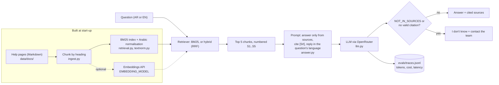

# Bilingual RAG assistant (Arabic / English)

Answers customer questions from a travel agency's help pages in Arabic or English, cites the page behind every fact, and says "I don't know" when the pages do not cover the question.

> All company documents in this repo describe **Sarab Travel, a fictional agency**. The policies are invented for the demo and are not real travel rules.

## 1. Demo

Demo video/Space: pending — to be recorded by Sara.

GIF: pending. Without an API key the demo runs in "search only" mode, which shows the passages retrieved for a question.

## 2. The problem

A support agent (or a customer on a help page) needs the *right* policy answer fast, in their own language, with a way to check where it came from. Two things make this hard in the Gulf:

- **Mixed languages.** Customers write in Arabic, English or a mix ("ما الذي تغطيه خطة Plus؟"), while some documents exist in only one language.
- **Confident wrong answers.** A language model will happily answer from its own memory. For refunds, visas and fees that is worse than no answer.

This project is a small, measurable version of that assistant: every answer must cite its source, uncited answers are blocked, and retrieval quality is measured on a labelled question set instead of judged by eye.

## 3. What it does

- Loads 16 fictional help pages (9 topics: 7 in both languages, 1 English-only, 1 Arabic-only) and splits them into chunks by heading.
- Searches with **BM25 written from scratch**, with Arabic normalisation (alef forms, ى/ي, ة/ه, diacritics, tatweel, Arabic-Indic digits) and a light Arabic stemmer. Optional embedding and hybrid (RRF) search through any OpenAI-compatible embeddings API.
- Answers with an LLM (OpenRouter) **only from the retrieved chunks**, citing them as `[S1]`, `[S2]`, in the question's language.
- Enforces grounding in code: no retrieved chunks → no model call; `NOT_IN_SOURCES` from the model, or an answer with no valid citation → the user sees "I don't know" and a contact for the support team.
- Evaluates on 60 labelled questions (30 Arabic, 30 English, 10 unanswerable, 8 cross-language) with gold source passages: hit@k, recall@5 and MRR now; citation accuracy, abstention and judged correctness once an API key is set.
- Gradio chat demo with the sources listed under each answer.

## 4. Architecture



| Component | File | Notes |
|---|---|---|
| Text normalisation | `src/bilingual_rag/textnorm.py` | Lucene-style Arabic normaliser, Light10-style stemmer, Snowball for English |
| Ingest and chunking | `src/bilingual_rag/ingest.py` | Section ids like `refunds#2` are shared by the EN and AR versions |
| Retrieval | `src/bilingual_rag/retrieval.py` | BM25 by hand; numpy cosine search (same as a FAISS flat index at this size); RRF hybrid |
| Answering | `src/bilingual_rag/answer.py` | Prompt, citation parsing, the three abstention paths |
| Model client | `src/bilingual_rag/llm.py` | One OpenAI-compatible client; `FakeLLM` for tests and dry runs |
| Evaluation | `evals/` | `retrieval_eval.py` (no LLM), `run.py` (full pipeline + judge) |
| Demo | `app/app.py` | Gradio; search-only mode when no key is set |

More detail: [docs/architecture.md](docs/architecture.md).

## 5. Results

### Measured on 2026-10-08 (retrieval only, no LLM)

Command: `python -m evals.retrieval_eval`. Corpus: the 16 fictional agency pages (90 section chunks). Questions: the 50 answerable questions in `evals/questions.jsonl` (the 10 unanswerable ones have no gold passage). A hit means a chunk from a gold section is in the top k. Outputs: `evals/results/`.

Default configuration (BM25, light stemming, one chunk per section):

| Question group | n | hit@1 | hit@3 | hit@5 | MRR@10 |
|---|---|---|---|---|---|
| All answerable | 50 | 0.50 | 0.76 | 0.78 | 0.64 |
| English, same-language | 21 | 0.57 | 0.95 | 0.95 | 0.75 |
| Arabic, same-language | 21 | 0.62 | 0.86 | 0.91 | 0.75 |
| Cross-language (answer only in the other language) | 8 | 0.00 | 0.00 | 0.00 | 0.02 |

Experiment 1, text analyzer and chunk size (all 50 answerable questions; hit@5 / MRR@10):

| Analyzer | Section chunks (90) | Small chunks, about 30 words (216) |
|---|---|---|
| Plain (lowercase only) | 0.68 / 0.55 | 0.66 / 0.57 |
| + Arabic normalisation and stopwords | 0.78 / 0.58 | 0.72 / 0.58 |
| + light stemming (default) | 0.78 / 0.64 | 0.76 / 0.63 |

On the 21 Arabic same-language questions, normalisation moved hit@5 from 0.76 to 0.91 (16 → 19 questions). With about 20 questions per group, one question is about 5 points, so treat small differences as noise.


Experiment 2, a score threshold as a cheap "I don't know" (BM25 top score, threshold chosen on the 20 dev questions): on the 40 test questions it caught **2 of 6** unanswerable questions and wrongly blocked **4 of 34** answerable ones, so it is **off by default**. Details: `evals/results/abstention_gate.json`.

### Pending live run (needs OpenRouter key)

| Metric | Status |
|---|---|
| Embedding and hybrid retrieval (BM25 vs hybrid; cross-language) | pending live run (needs OpenRouter key) |
| Answer correctness (judge model + Sara's check of 20 answers) | pending live run (needs OpenRouter key) |
| Citation accuracy (cited chunk is a gold section; judge: claim supported) | pending live run (needs OpenRouter key) |
| Correct "I don't know" on the 10 unanswerable questions | pending live run (needs OpenRouter key) |
| False "I don't know" on the 50 answerable questions | pending live run (needs OpenRouter key) |
| Answer language matches question language | pending live run (needs OpenRouter key) |
| Cost and latency per question | pending live run (needs OpenRouter key) |

`python -m evals.run --dry-run` proves the pipeline end to end with a fake model; its output in `evals/dry_run/` is **not** a result.

## 6. What failed and what I changed

Observed in the 2026-10-08 retrieval run (`evals/results/retrieval_per_question.csv`):

- **Cross-language retrieval fails completely with BM25 (0 of 8).** An Arabic question about travel insurance shares no words with the English-only insurance page, so BM25 returns Arabic pages that merely mention insurance. This is the main reason to test embeddings.
- **Arabic morphology still beats the stemmer.** "لم أكن راضية عن حل مشكلتي، كيف أصعّد الشكوى؟" retrieved nothing: مشكلتي vs مشكلة, أصعّد vs تصعيد, and the broken plural الشكوى vs الشكاوى share no stem under light stemming.
- **Synonyms beat keywords.** "two months" does not match "60 days", so the refund-delay section was ranked 8th.
- **Risky distractors.** For "Can I pay for an Umrah package in instalments?", BM25's top English hit is the *general* instalment rule ("yes, 3 instalments"), while the true answer (Arabic-only page: "no instalments for Umrah") is not retrieved. A model that answers from the top hit would be confidently wrong; the live run will show whether it abstains.
- **The score threshold did not generalise** from dev (4/4 unanswerable caught) to test (2/6), so it stays off.

Changes made while building (by the coding agent, before Sara's review):

- The "small" chunk setting was first 60 words, which produced almost the same chunks as one-per-section (the sections are short). It was reduced to 30 words so the chunking experiment compares two different things.
- The score gate was implemented, measured, and left switched off because of the test result above.

> TODO (Sara): list what you changed after reviewing (code, prompt, Arabic wording of documents and questions) and what the live run showed.

## 7. How to run

```bash
uv venv --python 3.13 .venv && source .venv/bin/activate   # Windows: .venv\Scripts\activate
uv pip install -e ".[app,dev]"                             # or: pip install -e ".[app,dev]"
pytest && ruff check .                                     # offline tests
python -m evals.retrieval_eval                             # retrieval experiment, no key needed
python app/app.py                                          # demo at http://127.0.0.1:7860
```

With an OpenRouter key in `Portfolio Projects/.env` or this repo's `.env` (see `.env.example`):

```bash
python -m evals.run --model cheap --limit 10    # small paid run first; check cost in evals/traces.jsonl
python -m evals.run --model main                # all 60 questions (stops if MAX_COST_PER_RUN_USD is passed)
python -m evals.retrieval_eval --with-embeddings  # needs EMBEDDING_MODEL
python -m bilingual_rag "كم يستغرق استرداد المبلغ؟"   # one question from the terminal
```

## 8. Data and licence

- `data/docs/agency/`: original fictional help pages written for this repo (MIT, like the code). Contact details use `example.com` and `+971 50 000 xxxx` placeholders.
- `data/docs/public/` (not included; created by `scripts/fetch_wikivoyage.py`): Wikivoyage and Wikipedia pages under **CC BY-SA 4.0**, with an attribution file. They keep that licence; they are not MIT.
- `evals/questions.jsonl`: 60 questions with gold sections and gold answers, written for this repo.

See [data/README.md](data/README.md).

## 9. How I used AI agents

> DRAFT for Sara to edit. Keep it true.

- Sara wrote the brief and the acceptance tests in the project's BUILD_SPEC: 60 bilingual questions with 10 unanswerable ones, citations, an "I don't know" path, two chunking settings, BM25 vs hybrid, and cross-language questions.
- A coding agent (Claude) generated the first version of the code, the fictional help pages in English and Arabic, the question set, the tests and these docs, and ran the retrieval evaluation.
- Sara will review, run and change it.

> TODO (Sara): list what you changed after reviewing.
> TODO (Sara): note which Arabic pages and questions you rewrote so they read naturally.
> TODO (Sara): add the live-run date, model IDs and what surprised you.

## 10. Limitations and next steps

- The LLM-based metrics, the hybrid experiment and the demo video are pending an API key.
- The questions were written by the same agent that wrote the documents, so they may share wording with them and flatter keyword search. Questions written by someone who has not read the pages would be a fairer test.
- 60 questions is a small set: per-group numbers move about 5 points per question.
- The corpus is 16 short pages; real help centres are larger and have conflicting versions of a policy.
- The Arabic light stemmer does not handle possessive forms (مشكلتي) or broken plurals.
- Next: run the live evaluation; try multilingual embeddings for cross-language questions; try translating the query into the other language before BM25; add page versions and conflicting policies; add a human hand-off screen.
