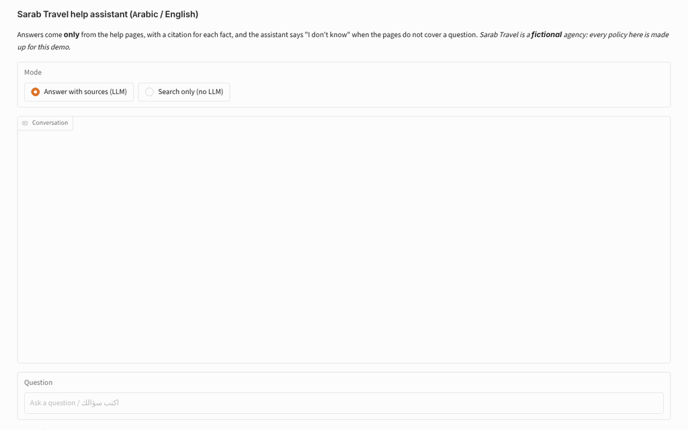
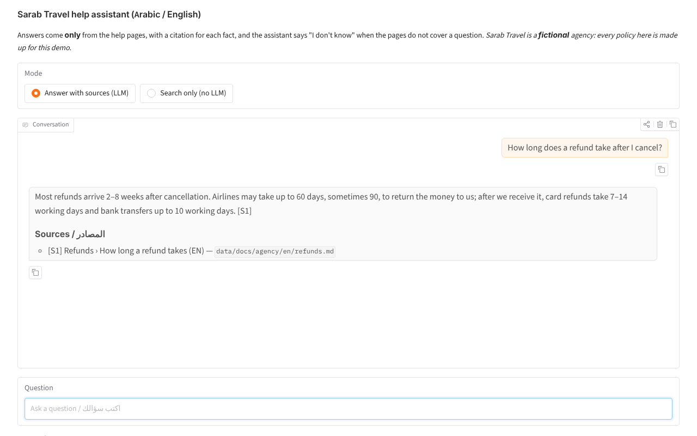
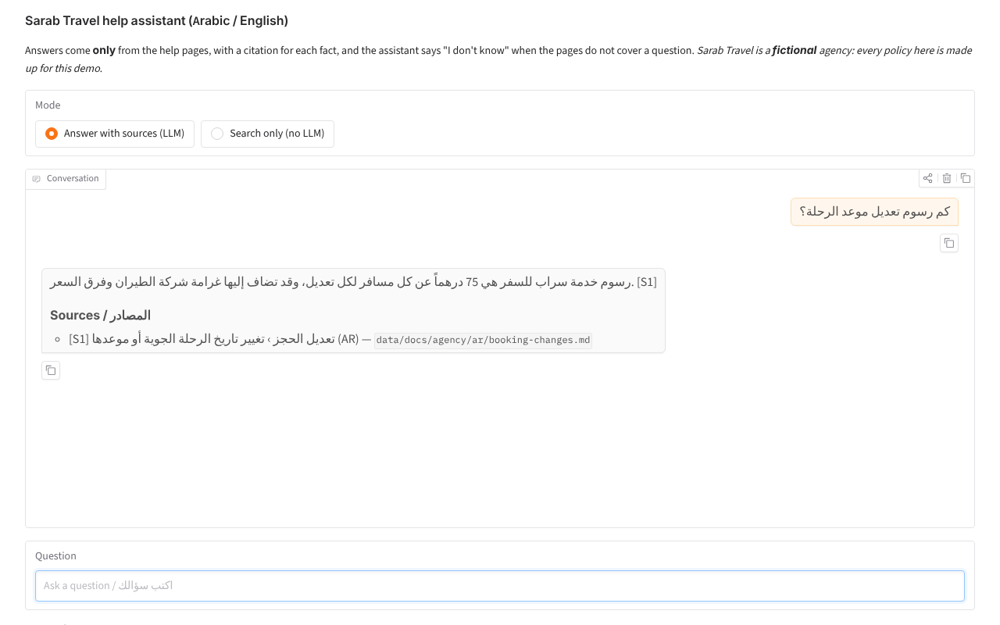
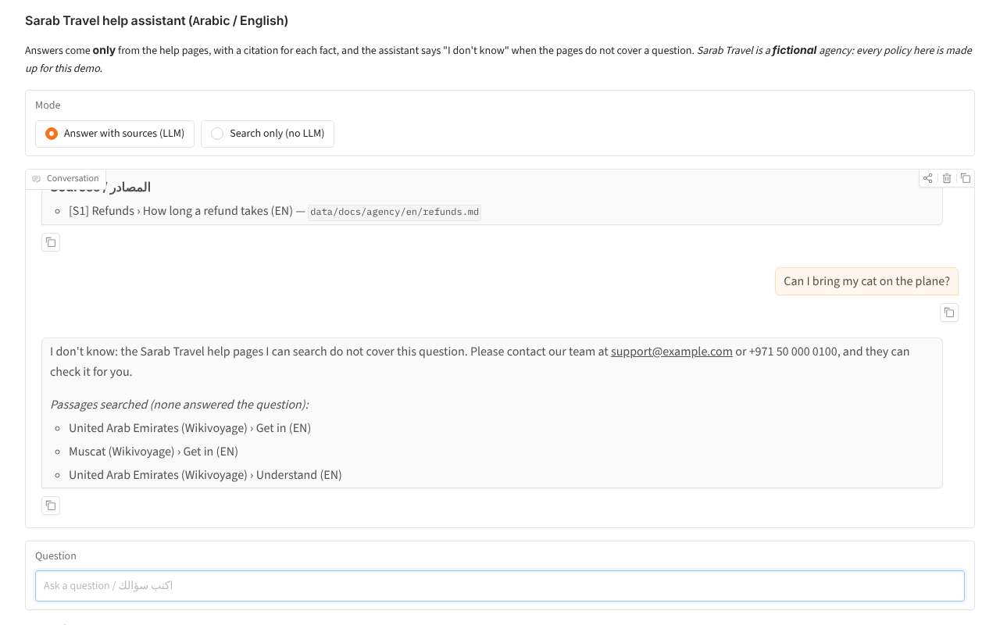
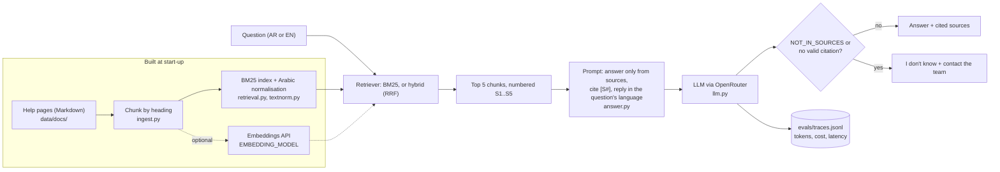
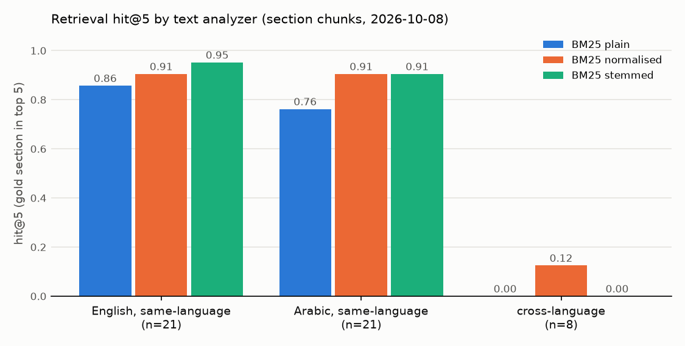
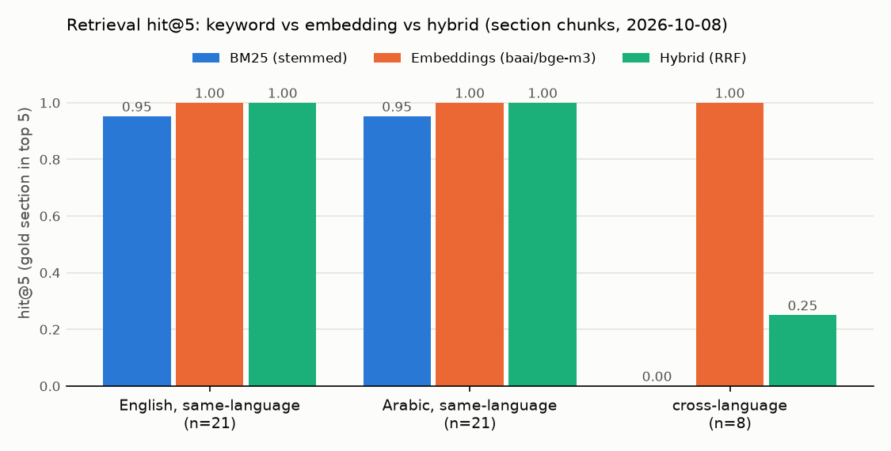

# Bilingual RAG assistant (Arabic / English)

Answers customer questions from a travel agency's help pages in Arabic or English, cites the page behind every fact, and says "I don't know" when the pages do not cover the question.

> All company documents in this repo describe **Sarab Travel, a fictional agency**. The policies are invented for the demo and are not real travel rules.

## 1. Demo

Live hosted demo: coming soon (Hugging Face Space).

Screenshots from a local run on 8 October 2026 in "Answer with sources" mode, with live AI (`openai/gpt-6-luna` through OpenRouter, the model used in the results below). Without an API key the demo runs in "search only" mode, which shows the passages retrieved for a question.


*An English question is answered with a citation, then a question the help pages do not cover gets "I don't know".*


*English answer with its citation [S1] and the help page it came from.*


*Arabic question about the fee for changing a trip date: the answer cites the Arabic help page.*


*"Can I bring my cat on the plane?" is not in the help pages, so the assistant says "I don't know" and lists the passages it searched.*

## 2. The problem

A support agent (or a customer on a help page) needs the *right* policy answer fast, in their own language, with a way to check where it came from. Two things make this hard in the Gulf:

- **Mixed languages.** Customers write in Arabic, English or a mix ("ما الذي تغطيه خطة Plus؟"), while some documents exist in only one language.
- **Confident wrong answers.** A language model will happily answer from its own memory. For refunds, visas and fees that is worse than no answer.

This project is a small, measurable version of that assistant: every answer must cite its source, uncited answers are blocked, and retrieval quality is measured on a labelled question set instead of judged by eye.

## 3. What it does

- Loads 16 fictional help pages (9 topics: 7 in both languages, 1 English-only, 1 Arabic-only) and splits them into chunks by heading. The demo also searches 8 openly licensed Wikivoyage/Wikipedia pages about Dubai, Abu Dhabi, the UAE, Muscat and Doha (CC BY-SA 4.0, kept in their own folder).
- Searches with **BM25 written from scratch**, with Arabic normalisation (alef forms, ى/ي, ة/ه, diacritics, tatweel, Arabic-Indic digits) and a light Arabic stemmer. Optional embedding and hybrid (RRF) search through any OpenAI-compatible embeddings API (measured with `baai/bge-m3` through OpenRouter).
- Answers with an LLM (OpenRouter) **only from the retrieved chunks**, citing them as `[S1]`, `[S2]`, in the question's language.
- Enforces grounding in code: no retrieved chunks → no model call; `NOT_IN_SOURCES` from the model, or an answer with no valid citation → the user sees "I don't know" and a contact for the support team.
- Evaluates on 60 labelled questions (30 Arabic, 30 English, 10 unanswerable, 8 cross-language) with gold source passages: retrieval hit@k and MRR, citation accuracy checked against the gold sections, "I don't know" on unanswerable questions, answer language, LLM-judged correctness, cost and latency. 10 extra questions test the public pages.
- Gradio chat demo with the sources listed under each answer.

## 4. Architecture



| Component | File | Notes |
|---|---|---|
| Text normalisation | `src/bilingual_rag/textnorm.py` | Lucene-style Arabic normaliser, Light10-style stemmer, Snowball for English |
| Ingest and chunking | `src/bilingual_rag/ingest.py` | Section ids like `refunds#2` are shared by the EN and AR versions |
| Retrieval | `src/bilingual_rag/retrieval.py` | BM25 by hand; numpy cosine search (same as a FAISS flat index at this size); RRF hybrid |
| Answering | `src/bilingual_rag/answer.py` | Prompt, citation parsing, the three abstention paths |
| Model client | `src/bilingual_rag/llm.py` | One OpenAI-compatible client; `FakeLLM` for tests and dry runs |
| Evaluation | `evals/` | `retrieval_eval.py` (no LLM), `run.py` (full pipeline + judge) |
| Demo | `app/app.py` | Gradio; search-only mode when no key is set |

More detail: [docs/architecture.md](docs/architecture.md).

## 5. Results

### Retrieval, measured on 2026-10-08 (BM25 needs no model)

Command: `python -m evals.retrieval_eval`. Corpus: the 16 fictional agency pages (90 section chunks). Questions: the 50 answerable questions in `evals/questions.jsonl` (the 10 unanswerable ones have no gold passage). A hit means a chunk from a gold section is in the top k. Outputs: `evals/results/`.

Default configuration (BM25, light stemming, one chunk per section):

| Question group | n | hit@1 | hit@3 | hit@5 | MRR@10 |
|---|---|---|---|---|---|
| All answerable | 50 | 0.50 | 0.76 | 0.78 | 0.64 |
| English, same-language | 21 | 0.57 | 0.95 | 0.95 | 0.75 |
| Arabic, same-language | 21 | 0.62 | 0.86 | 0.91 | 0.75 |
| Cross-language (answer only in the other language) | 8 | 0.00 | 0.00 | 0.00 | 0.02 |

Experiment 1, text analyzer and chunk size (all 50 answerable questions; hit@5 / MRR@10):

| Analyzer | Section chunks (90) | Small chunks, about 30 words (216) |
|---|---|---|
| Plain (lowercase only) | 0.68 / 0.55 | 0.66 / 0.57 |
| + Arabic normalisation and stopwords | 0.78 / 0.58 | 0.72 / 0.58 |
| + light stemming (default) | 0.78 / 0.64 | 0.76 / 0.63 |

On the 21 Arabic same-language questions, normalisation moved hit@5 from 0.76 to 0.91 (16 → 19 questions). With about 20 questions per group, one question is about 5 points, so treat small differences as noise.



Experiment 2, a score threshold as a cheap "I don't know" (BM25 top score, threshold chosen on the 20 dev questions): on the 40 test questions it caught **2 of 6** unanswerable questions and wrongly blocked **4 of 34** answerable ones, so it is **off by default**. Details: `evals/results/abstention_gate.json`.

Experiment 3, keyword vs embedding vs hybrid (live, 2026-10-08). Embeddings: `baai/bge-m3` through OpenRouter's embeddings API (multilingual, no query prefix needed). Command: `EMBEDDING_MODEL=baai/bge-m3 python -m evals.retrieval_eval --with-embeddings` (embedding cost US$0.0002). Same 50 answerable questions, section chunks:

| Retriever | All answerable (50): hit@1 / hit@5 / MRR@10 | English same-lang (21): hit@5 | Arabic same-lang (21): hit@5 | Cross-language (8): hit@5 |
|---|---|---|---|---|
| BM25, stemmed (default) | 0.50 / 0.78 / 0.64 | 0.95 | 0.91 | 0.00 |
| Embeddings (bge-m3) | 0.94 / 1.00 / 0.97 | 1.00 | 1.00 | 1.00 |
| Hybrid, BM25 + embeddings (RRF) | 0.78 / 0.88 / 0.83 | 1.00 | 1.00 | 0.25 |

Small chunks give the same picture (embeddings 1.00 hit@5, hybrid 0.90). Embeddings alone also win on the 16 answerable dev questions (16/16, hybrid 15/16, BM25 13/16); the dev split is what chose the retriever for the answer runs below. **Hybrid is worse than embeddings alone here:** for a cross-language question BM25 can only find same-language pages that share a word with the question, and RRF rewards chunks that both retrievers return, so those distractors push the right other-language passage out of the top 5.



Experiment 4, a bigger corpus: the 8 public pages added as distractors (299 section chunks instead of 90, about 12 times more text). Command: the same plus `--collections agency public --questions evals/questions.jsonl evals/questions_public.jsonl --out evals/results/agency_plus_public`.

| Retriever | Original 50 answerable, hit@5 / MRR@10: agency pages only → with public pages | 10 public-page questions: hit@5 / MRR@10 |
|---|---|---|
| BM25, stemmed | 0.78 / 0.64 → 0.76 / 0.62 | 0.60 / 0.52 |
| Embeddings (bge-m3) | 1.00 / 0.97 → 1.00 / 0.97 | 0.90 / 0.90 |
| Hybrid (RRF) | 0.88 / 0.83 → 0.92 / 0.83 | 0.80 / 0.62 |

The BM25 numbers on the agency-only corpus re-ran identically after this session's code changes (`evals/results/retrieval_summary.csv`).

### Answers, measured live on 2026-10-08

Answer model `openai/gpt-6-luna` (MODEL_CHEAP), judge `google/gemini-3.8-flash` (MODEL_JUDGE, a different model family), top 5 section chunks, temperature 0, the 60 questions in `evals/questions.jsonl` (50 answerable, 10 unanswerable), agency pages only. Command: `python -m evals.run --model cheap` with `--retriever bm25` (the default), `embedding` or `hybrid` (the last two with `EMBEDDING_MODEL=baai/bge-m3`). Per-question rows, summaries and 20-answer review sheets: `evals/results/run_20261008T*`. Every model call (tokens, cost, latency): `evals/traces.jsonl`. `python -m evals.compare_runs` rebuilds `evals/results/live_runs_comparison.csv` from the saved rows.

| Metric | BM25 (default) | Embeddings (bge-m3) | Hybrid (RRF) |
|---|---|---|---|
| **Judged correct, of 50 answerable** ("I don't know" counts as not correct) | 32/50 | **44/50** | 37/50 |
| Judged correct · partial, of the answers given | 32/43 · 7/43 | 44/50 · 6/50 | 37/47 · 7/47 |
| Correct "I don't know" on the 10 unanswerable | 10/10 | 10/10 | 10/10 |
| Wrong "I don't know" on the 50 answerable | 7/50 | 0/50 | 3/50 |
| Citation accuracy (deterministic): answers citing at least one gold section | 39/43 | 50/50 | 44/47 |
| Citation accuracy (deterministic): answers whose citations are all gold sections | 37/43 | 49/50 | 42/47 |
| Judge: every claim supported by the cited passages | 43/43 | 49/50 | 45/47 |
| Citations to a source number that does not exist | 0/60 | 0/60 | 0/60 |
| Answer in the question's language | 43/43 | 50/50 | 47/47 |
| Cross-language questions (8): judged correct | 0/8 | 8/8 | 2/8 |
| Cross-language answers citing the other-language page | 0 of 3 answers | 8 of 8 | 2 of 5 |
| Latency per question, retrieval + answer (mean / p95) | 1.88 s / 3.81 s | 3.13 s / 4.73 s | 2.87 s / 5.13 s |
| Answer cost per question | US$0.000095 | US$0.000096 | US$0.00010 |
| Whole run incl. judge (60 questions) | US$0.077 | US$0.078 | US$0.079 |

- Run files: BM25 `run_20261008T125724Z_openai-gpt-6-luna_bm25`, embeddings `run_20261008T130639Z_openai-gpt-6-luna_embedding`, hybrid `run_20261008T130807Z_openai-gpt-6-luna_hybrid`.
- The first full BM25 run (`run_20261008T124754Z_openai-gpt-6-luna_bm25`) is kept: the judge's verdicts were cut off on 3 of its 43 answers (section 6). It scored 31/50 judged correct, with the same abstention counts (10/10 and 7/50), 39/43 answers citing a gold section and 43/43 in the right language.
- Smoke run first: 10 questions, US$0.014 (`run_20261008T124025Z_openai-gpt-6-luna_bm25`).
- "Judged correct" is the judge model's verdict against the reference answer, **not a human score**. Most "partial" verdicts are answers that left out a secondary detail (for example that travel credit is valid for 12 months). Sara's check of 20 answers is still to do: `evals/results/run_20261008T130639Z_openai-gpt-6-luna_embedding_human_review.csv` (every 60-question run samples the same 20 questions).
- The judge costs about 12 times more than the answers: US$0.0012 vs US$0.0001 per question.

With the public pages searched too (70 questions: the 60 plus the 10 in `evals/questions_public.jsonl`; `--collections agency public --questions evals/questions.jsonl evals/questions_public.jsonl`):

| Metric | BM25 | Embeddings (bge-m3) |
|---|---|---|
| Original 60: judged correct, of 50 answerable | 32/50 | 42/50 |
| Original 60: correct "I don't know" on the 10 unanswerable | 9/10 | 9/10 |
| Original 60: wrong "I don't know" on the 50 answerable | 6/50 | 0/50 |
| 10 public-page questions: judged correct | 5/10 | 8/10 |
| 10 public-page questions: wrong "I don't know" | 4/10 | 1/10 |
| Whole run incl. judge (70 questions) | US$0.091 | US$0.102 |

Run files: `run_20261008T131438Z_openai-gpt-6-luna_bm25_agency-public` and `run_20261008T131437Z_openai-gpt-6-luna_embedding_agency-public`. In both runs the one unanswerable question that got an answer was answered from a public page (section 6).

Total spend for the live evaluation: about US$0.52 (chat calls US$0.515 summed from `evals/traces.jsonl`, including a run that was cut off part-way; embeddings about US$0.002).

`python -m evals.run --dry-run` proves the pipeline end to end with a fake model; its output in `evals/dry_run/` is **not** a result.

## 6. What failed and what I changed

Observed in the 2026-10-08 retrieval run (`evals/results/retrieval_per_question.csv`):

- **Cross-language retrieval fails completely with BM25 (0 of 8).** An Arabic question about travel insurance shares no words with the English-only insurance page, so BM25 returns Arabic pages that merely mention insurance. This is the main reason to test embeddings.
- **Arabic morphology still beats the stemmer.** "لم أكن راضية عن حل مشكلتي، كيف أصعّد الشكوى؟" retrieved nothing: مشكلتي vs مشكلة, أصعّد vs تصعيد, and the broken plural الشكوى vs الشكاوى share no stem under light stemming.
- **Synonyms beat keywords.** "two months" does not match "60 days", so the refund-delay section was ranked 8th.
- **Risky distractors.** For "Can I pay for an Umrah package in instalments?", BM25's top English hit is the *general* instalment rule ("yes, 3 instalments"), while the true answer (Arabic-only page: "no instalments for Umrah") is not retrieved. A model that answers from the top hit would be confidently wrong; the live run will show whether it abstains.
- **The score threshold did not generalise** from dev (4/4 unanswerable caught) to test (2/6), so it stays off.

Changes made while building (by the coding agent, before Sara's review):

- The "small" chunk setting was first 60 words, which produced almost the same chunks as one-per-section (the sections are short). It was reduced to 30 words so the chunking experiment compares two different things.
- The score gate was implemented, measured, and left switched off because of the test result above.

Live run on 2026-10-08 (coding agent; run files in `evals/results/`). No prompt was changed after seeing results, and the 60 questions and their gold labels are unchanged.

- **Wikimedia rate limits.** The first requests to the Wikivoyage/Wikipedia API got HTTP 429 ("too many requests", from a shared network address). `scripts/fetch_wikivoyage.py` now waits the number of seconds in the `Retry-After` header and tries again (up to 6 times); with that, all 8 pages downloaded. A second bug: `--out` pointing outside the repo crashed on a progress message. Both fixed, with tests.
- **The judge's verdicts were cut off.** The judge model (`google/gemini-3.8-flash`) reasons before it answers, and those tokens count towards `max_tokens`. With the default cap of 600, 3 of 43 verdicts in the first full run stopped at 596 tokens before the JSON was complete and were scored "unparsed". The judge now gets 2,000 tokens (`evals/judge.py`), every trace records `finish_reason` ("length" means cut off), and a test checks the cap. The re-run had 0 unparsed verdicts, and all 579 calls traced after the fix ended normally (`finish_reason` "stop"). Both runs are kept and reported.
- **Hybrid search hurt cross-language questions** (hit@5 0.25 vs 1.00 for embeddings alone; 2 of 8 vs 8 of 8 judged correct). BM25's same-language near-misses get votes from both retrievers in RRF. Left as measured; weighting the two retrievers is a next step, to be chosen on the dev split.
- **The risky distractor did produce wrong answers.** "Can I pay for an Umrah package in instalments?" (true answer, Arabic-only page: no). With BM25 the model hedged ("the help pages do not specify whether Umrah packages qualify") and then gave the general 3-instalment rule; with hybrid it answered "If the Umrah package is a holiday package priced above AED 3,000, you can pay in 3 monthly instalments". Both judged incorrect. With embeddings the Arabic Umrah page was retrieved and the answer was "No, instalments are not available for Umrah packages", citing it.
- **Hedged answers count as answers.** Prompt rule 5 asks the model to answer the part it can and say what the pages do not cover. So a reply such as "the sources do not say whether travel insurance covers dangerous sports; they only mention that some countries require insurance [S5]" has a valid citation and is scored as an answer (judged incorrect), not as "I don't know" (ar-25 in the hybrid run; en-14 and en-24 in the BM25 run).
- **Public pages leak into company questions.** With the Wikivoyage pages searchable, one unanswerable question per run got a hedged answer from them: "Do you offer car rental at the destination airport?" (BM25: car-rental desks at Doha and Muscat airports) and "هل تنظّمون رحلات سفاري في الصحراء؟" (embeddings: desert safaris in Dubai). Both said the pages do not say whether Sarab Travel offers this, but they are still counted as failed abstentions (9/10 in both runs). A fix to try: label each source as "Sarab Travel policy" or "general travel guide" in the prompt. Not done yet.
- **The code-level citation rule caught one non-answer.** In the first BM25 run the model wrote "The help pages do not say whether cats can travel in the cabin…" instead of the exact `NOT_IN_SOURCES` marker. It had no citation, so the user saw "I don't know" (status `ungrounded`), as designed.
- **Process.** One hybrid run was stopped part-way by a 10-minute time limit on the agent's command (13 calls, US$0.007, in `evals/traces.jsonl` without a results file) and was re-run in the background. Trace records now carry the run name so every call can be matched to its run.
- **Supporting changes:** `--collections` and `--questions` options for both evaluation scripts; per-question latency, cost, cited-passage language and an "all citations gold" check in `evals/run.py`; embedding cost tracking; `evals/compare_runs.py`; the chart legend moved so it no longer covers a bar label.

> TODO (Sara): list what you changed after reviewing (code, prompt, Arabic wording of documents and questions) and what the live run showed.

## 7. How to run

```bash
uv venv --python 3.13 .venv && source .venv/bin/activate   # Windows: .venv\Scripts\activate
uv pip install -e ".[app,dev]"                             # or: pip install -e ".[app,dev]"
pytest && ruff check .                                     # offline tests
python -m evals.retrieval_eval                             # retrieval experiment, no key needed
python app/app.py                                          # demo at http://127.0.0.1:7860
```

With an OpenRouter key in `Portfolio Projects/.env` or this repo's `.env` (see `.env.example`):

```bash
python -m evals.run --model cheap --limit 10    # small paid run first; check cost in evals/traces.jsonl
python -m evals.run --model cheap               # all 60 questions (stops if MAX_COST_PER_RUN_USD is passed)
export EMBEDDING_MODEL=baai/bge-m3              # the embeddings model measured on 2026-10-08 (OpenRouter)
python -m evals.retrieval_eval --with-embeddings && python -m evals.run --model cheap --retriever embedding
python -m bilingual_rag "كم يستغرق استرداد المبلغ؟"   # one question from the terminal
```

## 8. Data and licence

- `data/docs/agency/`: original fictional help pages written for this repo (MIT, like the code). Contact details use `example.com` and `+971 50 000 xxxx` placeholders.
- `data/docs/public/` (included): 5 English Wikivoyage pages and 3 Arabic Wikipedia pages (Dubai, Abu Dhabi, UAE, Muscat, Doha), downloaded on 2026-10-08 by `scripts/fetch_wikivoyage.py` and committed as a fixed snapshot with each page's revision id. They are under **CC BY-SA 4.0, not MIT**: the folder has its own `LICENSE.md` and `ATTRIBUTION.md`, and each file names its source, revision and contributors. Committed so the public-page evaluation can be reproduced; re-running the script fetches newer revisions.
- `evals/questions.jsonl`: 60 questions with gold sections and gold answers, written for this repo. `evals/questions_public.jsonl`: 10 extra questions about the public pages.

See [data/README.md](data/README.md).

## 9. How I used AI agents

> DRAFT for Sara to edit. Keep it true.

- Sara wrote the brief and the acceptance tests in the project's BUILD_SPEC: 60 bilingual questions with 10 unanswerable ones, citations, an "I don't know" path, two chunking settings, BM25 vs hybrid, and cross-language questions.
- A coding agent (Claude) generated the first version of the code, the fictional help pages in English and Arabic, the question set, the tests and these docs, and ran the retrieval evaluation.
- A coding agent (Claude) ran the live evaluation on 2026-10-08 through OpenRouter, fixed the bugs it exposed (section 6), downloaded the CC BY-SA public pages and wrote the 10 public-page questions.
- Sara will review, run and change it.

> TODO (Sara): list what you changed after reviewing.
> TODO (Sara): note which Arabic pages and questions you rewrote so they read naturally.
> TODO (Sara): add the live-run date, model IDs and what surprised you.

## 10. Limitations and next steps

- The demo video and Sara's hand check of 20 judged answers are still to do. Answer correctness is an LLM judge's verdict, not a human score.
- The live results come from one answer model (`openai/gpt-6-luna`) and mostly one run per setting, at temperature 0. The two full BM25 runs gave 31/50 and 32/50 judged correct (3 verdicts were cut off in the first, and some answers were worded differently), so differences of one or two questions are noise.
- Embedding retrieval is at the ceiling (50/50 hit@5) on this small, clean corpus with questions written by the agent that wrote the pages. It is not evidence that it would stay there on real help-centre data.
- The 10 public-page questions were written after reading the pages; 10 questions is a very small set.
- The questions were written by the same agent that wrote the documents, so they may share wording with them and flatter keyword search. Questions written by someone who has not read the pages would be a fairer test.
- 60 questions is a small set: per-group numbers move about 5 points per question.
- The corpus is 16 short pages; real help centres are larger and have conflicting versions of a policy.
- The Arabic light stemmer does not handle possessive forms (مشكلتي) or broken plurals.
- The Arabic and the new public-page questions have not been reviewed by a native speaker yet.
- Next: make embeddings the default retriever when an embeddings key is set; try weighted RRF or query translation so hybrid stops hurting cross-language questions (chosen on the dev split); label sources as "company policy" vs "general travel guide" so public pages cannot answer "do you offer…?" questions; add page versions and conflicting policies; add a human hand-off screen.
