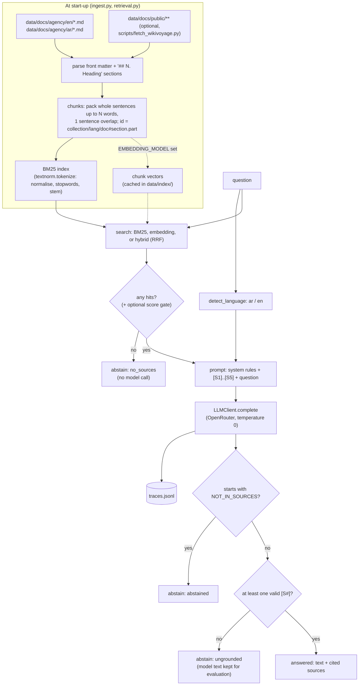

# Architecture

## Data flow

## Key decisions

| Decision | Why |
|---|---|
| BM25 written by hand, default retriever | No API or model download needed (Hugging Face was blocked on the build machine); every line can be explained in an interview. |
| Arabic normalisation before tokenising | Diacritics are not "word" characters in Python's regex, so `يومَي` would otherwise split into two tokens; alef/ya/ta-marbuta variants are typed interchangeably. |
| Light stemming, not a full morphological analyser | Light10-style prefix/suffix stripping is simple and known to work well for Arabic retrieval; its misses (possessives, broken plurals) are measured, not hidden. |
| Language-independent section ids (`refunds#2`) | Gold labels survive any chunk size, and an English chunk can count as a correct source for an Arabic question. |
| numpy instead of FAISS/Chroma | A few hundred vectors: a matrix product is instant and is exactly what a FAISS flat index computes. Swap in FAISS when the corpus grows. |
| Reciprocal Rank Fusion for hybrid | Uses ranks only, so BM25 scores and cosine similarities never need to share a scale. Measured on 2026-10-08: plain RRF hurt cross-language questions (BM25's same-language near-misses get two votes), so embeddings alone scored best here. |
| Citations enforced in code | The prompt asks for citations, but the code refuses to show an answer without a valid one. A missing citation is treated as possible hallucination. |
| `NOT_IN_SOURCES` sentinel | One exact string is easy to detect in any language; the user-facing "I don't know" text is then written by us, in the question's language. |
| Fixed agency-only corpus in the main eval | Keeps numbers comparable between runs. The public pages are a committed snapshot (revision ids recorded) evaluated in a separate run with their own 10 questions. |
| FakeLLM + dry-run folder | Tests and CI never touch the network; dry-run outputs live in `evals/dry_run/` so they cannot be mistaken for results. |

## Abstention paths

| Status | When | Model called? |
|---|---|---|
| `no_sources` | retrieval returned nothing (or the optional score gate fired) | no |
| `abstained` | the model replied `NOT_IN_SOURCES` | yes |
| `ungrounded` | the model answered without any valid `[S#]` citation | yes |
| `answered` | at least one valid citation | yes |

All three non-answer statuses show the same localised "I don't know" message with the support contact.
